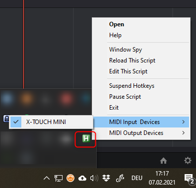

# XTouchMini-Davinci-Resolve-Midi-Adapter

Using this small AHK-Script you can control Davinci Resolve Video Editor with your cheap Behringer "X-TOUCH MINI" midi control panel on Windows.

  

## How It Works

* Listens to MIDI-Events form Behringer X-TOUCH
* Sends Keystrokes to currently open Program (DaVinci Resolve)
* Translates some MIDI commands (endless jog-shuttle mode, repeat some keys if pressed longer)
* Special Volume-Knob 8: Sets master Volume of you Soundcard and shows current value

## Why

* I already had an X-TOUCH MINI for using with Lightroom and [MIDI2LR](https://rsjaffe.github.io/MIDI2LR/)
* The Free Software [MIDI2KEY](https://midikey2key.de/) was fine for some basic key translations, but i was not really satisfied.
* The 60 EUR Software [Bomes MIDI Translator](https://www.bome.com/products/miditranslator) has some great features, but using the Rules for more complex keystrokes is annoying and every keystroke has only one output. Not worth the money just for this.
* I've found AutoHotKey and the MIDI Support from [DannyWarren's AutoHotkey-Midi](https://github.com/dannywarren/AutoHotkey-Midi) and added MIDI Out functionality.

## Setup

* Download and Install AutoHotKey 1.x from <http://ahkscript.org/> with default Options
* Connect X-TOUCH MINI
* Download and Unzip ``XTouchMini-Davinci-Resolve-Midi-Adapter.zip`` from <https://github.com/fashberg/XTouchMini-Davinci-Resolve-Midi-Adapter/releases>
* Double click ``xtouch_davinci_resolve.ahk`` to start
* All X-TOUCH Buttons will flash once to say hello
* It will run now in tray (green "H")
* Open DaVinci Resolve and enjoy new functionality
* In the folder print-overlay you will find a PDF to label your X-TOUCH

## Requirements

* DaVinci Resolve (Free or Studio)
* Windows OS
* A modern version of AutoHotKey (1.1+) from <http://ahkscript.org/>
* AutoHotkey-Midi from <https://github.com/fashberg/AutoHotkey-Midi>
* A system with winmm.dll (Windows 2000 or greater)
* A Behringer X-TOUCH MINI <https://www.behringer.com/product.html?modelCode=P0B3M>

### Keymappings

* You have to use the DaVinci Resolve Mapping (Menue->DaVinci Resolve->Keyboard Customization...)
* For moving Keyframes you also have to map:

### Exit/Restart

* check the green "H" in your System-Tray

## What's not possible

* Black Magic Design offers no API to read settings, current values, etc.., maybe because they build itself excellent Editing and Grading Panels and they want to sell them (i've played a little bit with fusion script with no success)
* So we can only do whats also can be controlled by keystrokes

## Hacking

Feel Free to change to your needs.
I suggest [Microsoft Visual Studio Code](https://code.visualstudio.com/) to edit and debug AHK, also install this extensions [AutoHotKey Debug](https://marketplace.visualstudio.com/items?itemName=helsmy.autohotkey-debug) and [AutoHotkey Plus](https://marketplace.visualstudio.com/items?itemName=cweijan.vscode-autohotkey-plus)
